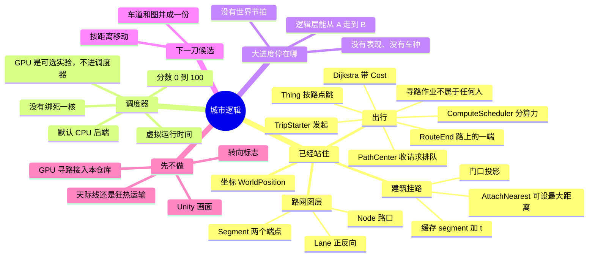

# 路网与出行 · 给你看的进度图

打开后用 Markdown 预览看图。这不是实现任务。



## 大进度

整座城：环境 → 核心对象 → 规则 → 命令行实验 → 以后才是画面 / 存档 / 交通经济。

| 层 | 状态 |
|---|---|
| 环境能编、能测、能跑命令行 | 完成 |
| 路网图层（点、段、车道） | 完成，还粗 |
| 建筑挂在路上，不进全局图；太远可不挂 | 完成，还粗 |
| 出行：排队求路 + 局部进出 | 完成，还粗 |
| 事物真的在路上连续开 | 未做（现在是跳路点） |
| 车/人差别、世界每帧转 | 未做 |
| 转向、标志、画面 | 故意后做 |

一句话：**逻辑上已经能「从一端到另一端」；还不是一座会自己转的城。**

## 小进度

**刚切完**

1. `TripStarter` 发起出行；建筑不再下指令
2. `RouteEnd` 解绑建筑
3. `Thing.Advance()` 跳逻辑点
4. `ComputeScheduler` 只管排队和顺序；默认 `CpuParallelBackend`；GPU 后端不挂在调度器上
5. `PathCenter` 收请求排队；计算作业不属于任何人
6. `AttachNearest(network, maxDistance)`：不传距离时行为与从前相同；太远不挂

**还没切（按会卡住扩展的顺序）**

1. 车道方向和寻路邻接表是两套图，单行以后会对不上
2. 走路是跳点，没有速度、没有每帧走一段距离
3. 路改了，建筑身上的 `segment+t` 不会失效
4. `AttachNearest` 仍扫全部路段（没有空间索引，按设计先不做）

## 一次出行现在怎么走

```text
建筑或路上的点
  → RouteEnd（挂接点 + 进出点）
  → TripStarter 发起
  → PathCenter 排队 → Scheduler 管中心并计算
  → 同一段：只走 t→t
  → 跨段：出门 → 入口 Node → 全局最短路 → 出口 Node → 进门
  → Thing 按步骤往前跳
```

建筑只是地点。路网只是 Node 和 Segment。不要把楼塞进全局图。

模块边界见 `docs/human/架构.md`。路线见 `docs/human/迭代路线.md`。
