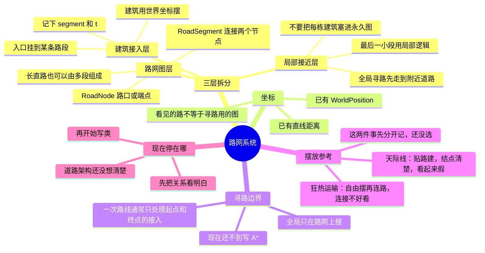

# 路网系统 · 给你看的思路图

这不是实现清单，也不是定稿。打开本文件后用 Markdown 预览看图。

## 对照文字

- **路网图层**：稳定的点和段，给全局寻路用。
- **建筑接入层**：入口挂在路段上，存 `segment + t`（`t=0` 是段起点，`t=1` 是段终点）。
- **局部接近层**：路找到了以后，再走入口前最后那一小段。
- **还没拍板**：贴路建设更清晰，自由摆放更自然；逻辑和观感先不要合成一套。
